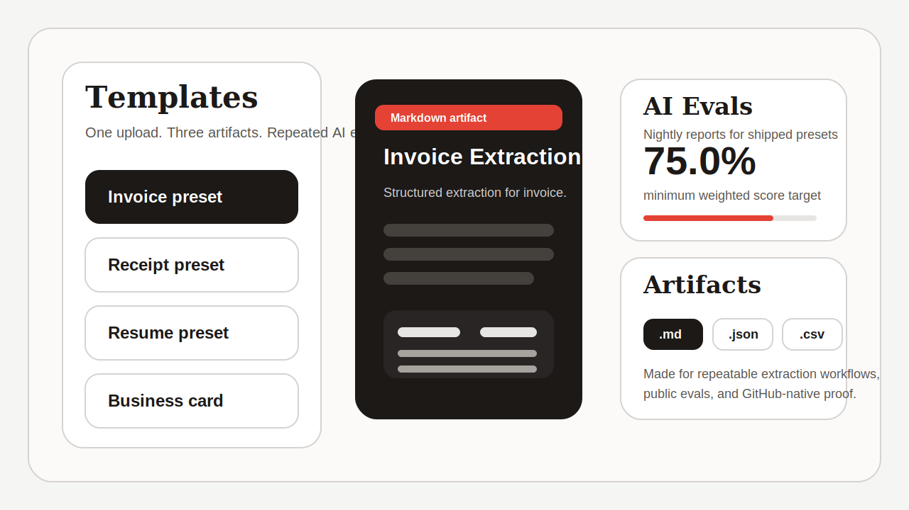
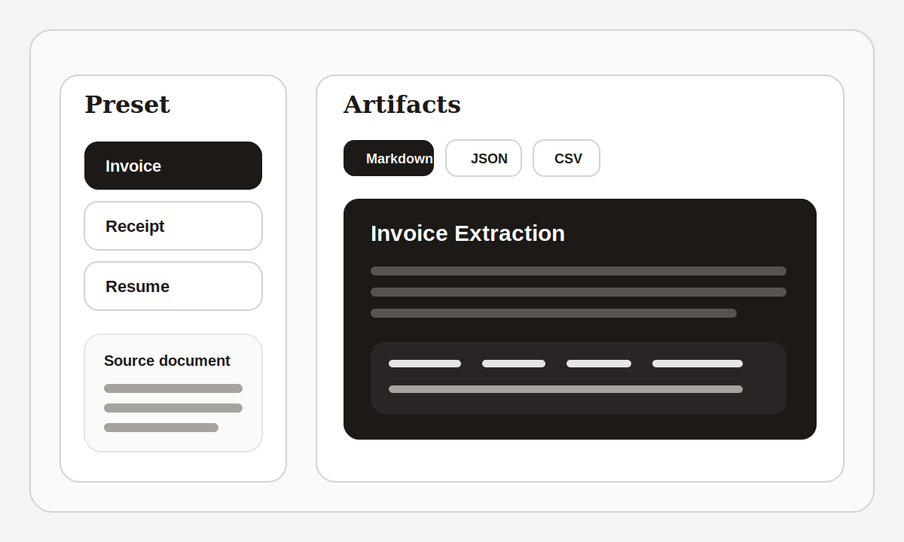
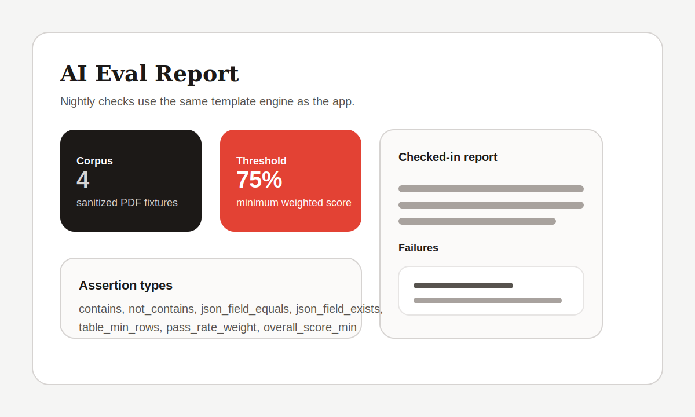
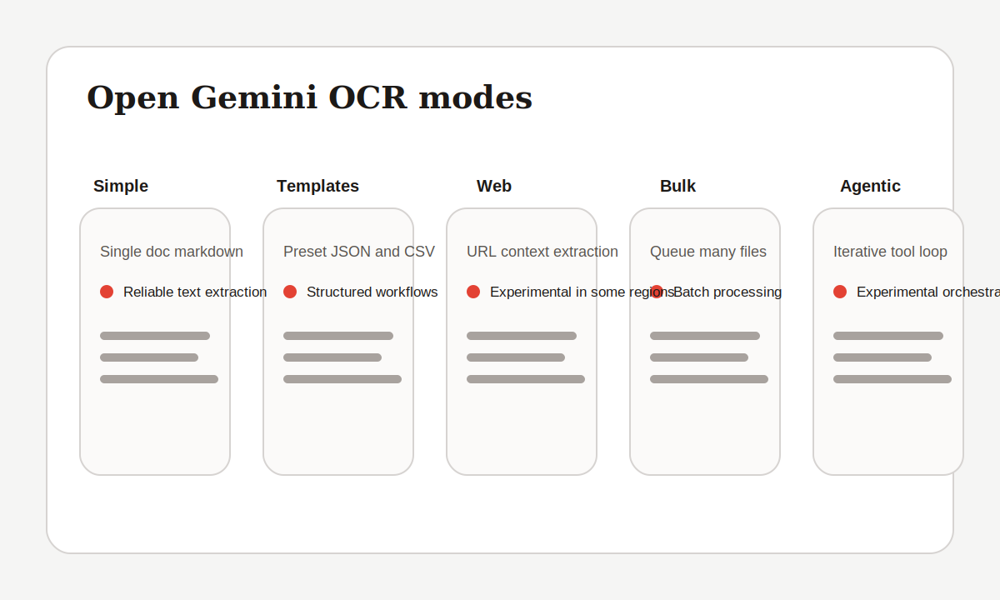

# Open Gemini OCR

Open-source OCR web app for extracting text and structured data from images, PDFs, and URLs with Google Gemini.

[](https://app.netlify.com/start/deploy?repository-url=https://github.com/cyanxxy/open-Gemini-ocr)
[](https://vercel.com/new/clone?repository-url=https://github.com/cyanxxy/open-Gemini-ocr)
[](https://opensource.org/licenses/MIT)



## What Is New

- **Templates workflow** for invoice, receipt, resume, and business-card extraction
- **Three artifacts from one run**: markdown, JSON, and CSV where the preset is tabular
- **Checked-in AI eval scaffolding** with a public corpus, assertion-based cases, and nightly live eval workflow
- **Sharper public proof** with previews, roadmap, and contributor-focused docs

## Quick Links

- **Deploy your own live copy**: use the Netlify or Vercel buttons above
- **Latest AI eval report**: [evals/reports/latest.md](evals/reports/latest.md)
- **Contributing guide**: [CONTRIBUTING.md](CONTRIBUTING.md)

## Why This Repo Is Different

- Most open OCR demos stop at markdown. This project now ships a dedicated **Templates** mode that turns OCR into reusable structured extraction.
- The repo includes a public `evals/` layout so changes can be measured with assertion-based AI evals instead of hand-wavy benchmark claims.
- The app stays **client-first**. Templates and evals build on the same extraction engine without introducing a required backend.

## Product Preview

### Templates



Templates is the new headline workflow. Pick a preset, upload a document, and the app returns:

- `markdown` for human review and copy/paste
- `json` for downstream automation
- `csv` when the preset is row-oriented

Shipped presets:

| Preset | Output shape | Designed for |
| --- | --- | --- |
| Invoice | `table` | AP invoices, vendor statements, line items |
| Receipt | `table` | Store receipts, spend capture, merchant logs |
| Resume | `record` | Candidate intake and recruiting workflows |
| Business card | `record` | Contact capture and lightweight CRM entry |

Example structured output:

```json
{
  "presetId": "invoice",
  "documentType": "Invoice",
  "summary": "Structured extraction for invoice.",
  "fields": {
    "invoice_number": { "value": "INV-2026-0142", "confidence": 0.94, "required": true, "type": "text" },
    "vendor_name": { "value": "Northwind Supply Co.", "confidence": 0.96, "required": true, "type": "text" },
    "total": { "value": "1471.50", "confidence": 0.97, "required": true, "type": "currency" }
  },
  "rows": [
    { "description": "Monthly retainer", "quantity": "1", "unit_price": "1200.00", "line_total": "1200.00" },
    { "description": "Support hours", "quantity": "3", "unit_price": "50.00", "line_total": "150.00" }
  ]
}
```

### AI Evals



The repo includes a public eval scaffold under `evals/`:

- `evals/corpus/`: sanitized PDF fixtures
- `evals/cases/`: assertion-based cases
- `evals/reports/latest.json`: machine-readable summary
- `evals/reports/latest.md`: human-readable report

The shipped suite now covers:

- `simple` OCR on full-text extraction
- `template` OCR on structured preset extraction
- `agentic` OCR on iterative field extraction

Supported assertion types:

- `contains`
- `not_contains`
- `json_field_equals`
- `json_field_exists`
- `table_min_rows`
- `pass_rate_weight`
- `overall_score_min`

Run them locally:

```bash
npm run evals:validate
GEMINI_API_KEY=your_key npm run evals
npm run evals:report
```

The checked-in report is refreshed by the nightly/manual workflow and can also be regenerated locally with a Gemini API key.

## Mode Comparison



| Mode | Best for | Output | Notes |
| --- | --- | --- | --- |
| Simple OCR | One image or PDF | Markdown | Most straightforward path for plain extraction |
| Templates | Structured workflows | Markdown, JSON, CSV | New headline mode for repeatable extraction |
| Web OCR | URL analysis and extraction | Markdown | Depends on Gemini URL-context availability |
| Bulk OCR | Multi-file jobs | Combined markdown | Good for queues and bulk review |
| Agentic OCR | Iterative extraction loops | Structured fields + logs | Experimental and more variable by design |

## Reliable Vs Experimental

### Reliable today

- Simple OCR for single images and PDFs
- Bulk OCR for multi-file markdown extraction
- Templates for repeatable structured extraction on supported documents
- Handwriting mode for tougher scans

### Experimental today

- Web OCR, because Gemini URL-context availability can vary by region, key, and model support
- Agentic OCR, because function-calling loops trade determinism for deeper extraction attempts

## Supported Models

The app currently exposes these preview models in settings:

| Model | API model ID | Thinking levels |
| --- | --- | --- |
| Gemini 3 Flash (Preview) | `gemini-3-flash-preview` | `MINIMAL`, `LOW`, `MEDIUM`, `HIGH` |
| Gemini 3.1 Pro (Preview) | `gemini-3.1-pro-preview` | `LOW`, `MEDIUM`, `HIGH` |

Notes:

- `MINIMAL` is Flash-only.
- Existing saved `gemini-3-pro-preview` settings are migrated to `gemini-3.1-pro-preview`.

## Requirements

- Node.js `>= 20.19.0`
- npm
- Google Gemini API key ([Get key](https://aistudio.google.com/app/apikey))

## Quick Start

```bash
git clone https://github.com/cyanxxy/open-Gemini-ocr.git
cd open-Gemini-ocr
npm install
npm run dev
```

Open `http://localhost:5173`, then:

1. Open **Settings**
2. Paste your Gemini API key
3. Choose a model and thinking level
4. Start with **Templates** if you want structured outputs

## Limits And Input Support

- Max file size: **20 MB** per file
- Supported local files: images (`image/*`) and PDFs (`application/pdf`)
- Web OCR: up to **20 URLs** per request

## Available Scripts

```bash
npm run dev
npm run build
npm run preview
npm run lint
npm run test
npm run test:run
npm run test:coverage
npm run test:ui
npm run evals
npm run evals:report
npm run evals:validate
```

## Project Structure

```text
src/
  components/         UI components
  pages/              App routes (Simple, Templates, Web, Bulk, Agentic)
  store/              Zustand state stores
  lib/gemini/         Gemini client, extraction, URL operations, types
  lib/templates/      Preset definitions and structured extraction engine
  lib/evals.ts        Shared eval validation and reporting logic
evals/
  corpus/             Sanitized PDF fixtures
  cases/              Assertion-based eval cases
  reports/            Latest checked-in eval reports
```

## Security And Privacy

- API keys are saved in localStorage with lightweight obfuscation.
- This is not a substitute for secure secret storage on shared or untrusted devices.
- Files are processed client-side before Gemini API calls; model requests are sent to Google APIs.

See [SECURITY.md](SECURITY.md) for reporting and policy details.

## Contributing

Contributions are welcome. Useful places to start:

- `good first issue`: Docs polish, eval fixtures, preset copy, and UI refinements
- `help wanted`: New presets, additional eval cases, and report improvements
- `docs`: README visuals, workflow explainers, and contributor guidance

Read:

- [CONTRIBUTING.md](CONTRIBUTING.md)
- [CODE_OF_CONDUCT.md](CODE_OF_CONDUCT.md)
- [SECURITY.md](SECURITY.md)

If Discussions are enabled on the repo, create categories with the slugs `show-and-tell` and `eval-failures` to activate the checked-in discussion templates.

## License

MIT. See [LICENSE](LICENSE).
